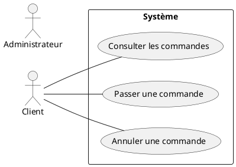

# Spécification de construction d’un Diagramme de Cas d’Utilisation UML

## 1. Objectif

Ce document définit les règles de construction, de structuration et de validation d’un Diagramme de Cas d’Utilisation UML, ci-après nommé **DCU**.

Il doit être utilisé comme référentiel par tout agent chargé de produire un DCU à partir d’exigences fonctionnelles, de besoins métier, de user stories, de spécifications ou d’une description textuelle d’un système.

L’objectif principal est de produire un diagramme :
- conforme à UML ;
- centré sur les interactions métier ;
- lisible ;
- non redondant ;
- indépendant de l’implémentation technique ;
- suffisamment abstrait pour représenter le besoin fonctionnel.

---

# 2. Principes fondamentaux

Un DCU représente **ce que le système permet de faire** et **qui interagit avec lui**.

Il ne doit pas représenter :
- l’architecture technique ;
- les composants logiciels ;
- les classes ;
- les tables de base de données ;
- les endpoints API ;
- les écrans ;
- les boutons ;
- les étapes internes d’un algorithme ;
- l’enchaînement temporel détaillé d’un processus.

Le DCU répond principalement aux questions suivantes :

- Qui interagit avec le système ?
- Quels services fonctionnels le système fournit-il ?
- Quels acteurs déclenchent ou participent à ces services ?
- Quels comportements sont partagés, optionnels ou spécialisés ?

---

# 3. Frontière du système

Le système étudié doit être représenté par une frontière explicite.

La frontière doit :
- être représentée par un rectangle ;
- porter le nom du système ;
- contenir tous les cas d’utilisation ;
- ne contenir aucun acteur.

Exemple :

```text
+------------------------------------+
|       Système de réservation       |
|                                    |
|   (Réserver une chambre)           |
|   (Annuler une réservation)        |
|                                    |
+------------------------------------+
```

Les acteurs sont placés à l’extérieur.

Un acteur appartenant à un autre système reste extérieur à la frontière, même s’il est techniquement intégré au système étudié.

---

# 4. Identification des acteurs

## 4.1 Définition

Un acteur représente un **rôle externe** qui interagit avec le système.

Un acteur peut être :
- un utilisateur humain ;
- une organisation ;
- un système externe ;
- un service externe ;
- un équipement externe.

Un acteur représente un **rôle**, et non nécessairement une personne physique précise.

Exemples valides :
- Client
- Administrateur
- Gestionnaire
- Système de paiement
- Service d’authentification

Exemples à éviter :
- Jean Dupont
- Écran d’accueil
- Base PostgreSQL
- Backend
- API REST interne

---

## 4.2 Identification des acteurs

Un acteur doit être créé lorsqu’une entité externe :
- déclenche un cas d’utilisation ;
- reçoit un résultat du système ;
- fournit une information nécessaire au système ;
- intervient directement dans une interaction fonctionnelle.

Ne pas créer un acteur pour chaque type d’utilisateur si leurs interactions avec le système sont identiques.

Dans ce cas, préférer un acteur générique.

Exemple :

```text
Utilisateur
   ^
   |
+--+---------+
|            |
Client    Employé
```

---

# 5. Cas d’utilisation

## 5.1 Définition

Un cas d’utilisation représente un **service ou objectif fonctionnel fourni par le système à un acteur**.

Un cas d’utilisation doit avoir une valeur métier identifiable.

Un cas d’utilisation doit normalement pouvoir compléter la phrase :

> « L’acteur utilise le système pour… »

Exemples :

- Créer un compte
- Se connecter
- Passer une commande
- Consulter une facture
- Annuler une réservation
- Générer un rapport

---

# 6. Règles de nommage

Les noms des cas d’utilisation doivent :

- commencer par un verbe d’action ;
- exprimer un objectif fonctionnel ;
- être compréhensibles par un utilisateur métier ;
- éviter les termes techniques.

Préférer :

```text
Consulter une commande
Modifier une commande
Valider un paiement
Générer un rapport
```

Éviter :

```text
Commande
Paiement
Gestion commande
CRUD commande
POST /orders
Affichage écran commande
```

Éviter également les formulations trop génériques :

```text
Gérer les utilisateurs
Gérer les commandes
Gérer les données
```

Lorsque cela améliore la compréhension, décomposer ces notions en actions concrètes.

Exemple :

```text
Créer un utilisateur
Modifier un utilisateur
Désactiver un utilisateur
Consulter un utilisateur
```

---

# 7. Niveau d’abstraction

Tous les cas d’utilisation d’un même diagramme doivent conserver un niveau d’abstraction cohérent.

Éviter de mélanger :

```text
Gérer une commande
Cliquer sur le bouton Valider
Encoder le JSON
Envoyer une requête HTTP
```

Les trois derniers éléments sont des détails d’interface ou d’implémentation.

Le diagramme doit rester au niveau fonctionnel.

---

# 8. Association acteur / cas d’utilisation

Une association indique qu’un acteur participe à un cas d’utilisation.

Elle est représentée par une ligne entre l’acteur et le cas d’utilisation.

Exemple :

```text
Client -------- (Passer une commande)
```

Ne pas utiliser une flèche pour exprimer un simple déclenchement sauf convention spécifique imposée par l’outil.

Une association ne signifie pas :
- un appel technique ;
- un flux de données ;
- une dépendance logicielle ;
- une séquence temporelle.

---

# 9. Relation <<include>>

## 9.1 Définition

La relation `<<include>>` indique qu’un cas d’utilisation réutilise **systématiquement** le comportement d’un autre cas d’utilisation.

Elle doit être utilisée lorsqu’un comportement :
- est obligatoire ;
- est commun à plusieurs cas d’utilisation ;
- mérite d’être isolé.

Exemple :

```text
(Passer une commande)
        |
        | <<include>>
        v
(Calculer le montant)
```

Le cas inclus est toujours exécuté dans le scénario concerné.

---

## 9.2 Règle de direction

La flèche `<<include>>` va :

```text
cas principal → cas inclus
```

Exemple PlantUML :

```plantuml
UC_Commande ..> UC_Calcul : <<include>>
```

---

## 9.3 Mauvais usage

Ne pas créer de `<<include>>` uniquement pour représenter une succession d’étapes.

Exemple incorrect :

```text
Se connecter
   include
Afficher l’écran
   include
Cliquer sur bouton
```

Un DCU n’est pas un diagramme de processus.

---

# 10. Relation <<extend>>

## 10.1 Définition

La relation `<<extend>>` représente un comportement :
- facultatif ;
- conditionnel ;
- déclenché dans certaines circonstances ;
- venant compléter un cas principal.

Exemple :

```text
(Appliquer un coupon)
        |
        | <<extend>>
        v
(Passer une commande)
```

Le passage de commande peut exister sans l’application d’un coupon.

---

## 10.2 Règle de direction

La flèche va :

```text
cas d’extension → cas étendu
```

Exemple PlantUML :

```plantuml
UC_Coupon ..> UC_Commande : <<extend>>
```

---

# 11. Distinction include / extend

Utiliser :

```text
<<include>>
```

lorsque le comportement est **obligatoire**.

Utiliser :

```text
<<extend>>
```

lorsque le comportement est **optionnel ou conditionnel**.

Question de contrôle :

> Le cas principal peut-il accomplir son objectif sans le comportement concerné ?

Si NON :

```text
<<include>>
```

Si OUI :

```text
<<extend>>
```

---

# 12. Généralisation des acteurs

La généralisation peut être utilisée lorsqu’un acteur spécialisé hérite des interactions d’un acteur plus général.

Exemple :

```text
        Utilisateur
        /         \
     Client    Administrateur
```

L’acteur spécialisé hérite des associations de l’acteur parent.

Ne pas utiliser la généralisation uniquement pour reproduire un organigramme.

Elle doit représenter une relation réelle de spécialisation fonctionnelle.

---

# 13. Généralisation des cas d’utilisation

La généralisation entre cas d’utilisation est autorisée lorsque plusieurs cas représentent des variantes spécialisées d’un comportement plus général.

Elle doit être utilisée avec parcimonie.

Préférer une représentation simple si une généralisation n’apporte pas de compréhension supplémentaire.

---

# 14. Gestion de l’authentification

Ne pas ajouter automatiquement :

```text
Se connecter
```

comme `<<include>>` de tous les cas nécessitant un utilisateur authentifié.

Si l’authentification constitue seulement une précondition, elle doit être traitée comme telle dans la spécification détaillée du cas d’utilisation.

Créer un cas d’utilisation « Se connecter » uniquement si l’authentification constitue réellement une interaction fonctionnelle visible pour l’acteur.

Éviter :

```text
Consulter commande
    include → Se connecter

Modifier commande
    include → Se connecter

Supprimer commande
    include → Se connecter
```

sauf si le processus métier impose explicitement l’exécution de l’authentification dans chacun de ces cas.

---

# 15. Systèmes externes

Un système externe doit être représenté comme acteur lorsqu’il interagit fonctionnellement avec le système étudié.

Exemples :

```text
Service de paiement
Service d’identité
ERP externe
Service de messagerie
```

Ne pas représenter comme acteur les composants internes au système.

Exemple à éviter :

```text
Frontend
Backend
Base de données
Microservice utilisateur
```

sauf si le périmètre étudié porte explicitement sur un sous-système et que ces éléments deviennent alors externes à ce périmètre.

---

# 16. CRUD

Ne pas transformer mécaniquement chaque entité métier en quatre cas :

```text
Créer X
Lire X
Modifier X
Supprimer X
```

Créer ces cas uniquement lorsqu’ils représentent réellement des objectifs fonctionnels distincts.

Le diagramme doit refléter le métier et non l’organisation des opérations techniques.

---

# 17. Interface utilisateur

Les éléments d’interface ne doivent pas apparaître comme cas d’utilisation.

Éviter :

```text
Afficher écran de connexion
Cliquer sur Valider
Ouvrir popup
Afficher tableau
Sélectionner menu
```

Préférer :

```text
Se connecter
Valider une commande
Consulter les commandes
```

---

# 18. Flux de données

Le DCU ne doit pas représenter les flux de données.

Éviter :

```text
Utilisateur → JSON → API → Base de données
```

Utiliser pour cela un diagramme de séquence, un diagramme d’activité ou un diagramme d’architecture.

---

# 19. Ordonnancement

Les positions verticales ou horizontales des cas d’utilisation ne doivent pas être interprétées comme une chronologie.

Un DCU ne décrit pas un ordre d’exécution.

Ne pas créer de relations simplement pour indiquer :

```text
A puis B puis C
```

---

# 20. Lisibilité

Le diagramme doit privilégier la compréhension.

L’agent doit :
- limiter les croisements de lignes ;
- rapprocher les acteurs de leurs cas d’utilisation ;
- regrouper les cas appartenant au même domaine ;
- utiliser des noms courts et explicites ;
- éviter les relations inutiles ;
- éviter la surcharge du diagramme.

Lorsque le diagramme devient trop dense, produire plusieurs diagrammes thématiques.

Exemple :

```text
DCU global
DCU Administration
DCU Gestion des commandes
DCU Facturation
```

---

# 21. Taille recommandée

Un DCU principal devrait idéalement contenir environ :

- 2 à 8 acteurs ;
- 5 à 20 cas d’utilisation.

Au-delà, l’agent doit envisager une décomposition par domaine fonctionnel.

Ces valeurs sont des recommandations de lisibilité et non des contraintes UML.

---

# 22. Détection des doublons

Avant création d’un nouveau cas d’utilisation, l’agent doit vérifier qu’un cas fonctionnel équivalent n’existe pas déjà.

Exemple :

```text
Voir une commande
Consulter une commande
Afficher une commande
```

doivent normalement être regroupés sous :

```text
Consulter une commande
```

---

# 23. Cas trop génériques

Un cas tel que :

```text
Administrer le système
```

peut être conservé uniquement dans un diagramme de très haut niveau.

Dans un diagramme fonctionnel détaillé, il doit être remplacé par des objectifs plus précis.

---

# 24. Cas trop fins

Ne pas transformer chaque étape d’un scénario en cas d’utilisation.

Exemple incorrect :

```text
Saisir email
Saisir mot de passe
Cliquer connexion
Vérifier mot de passe
Créer session
```

Cas attendu :

```text
Se connecter
```

---

# 25. Règles d’inférence pour l’agent

Lors de l’analyse d’une spécification textuelle :

1. Identifier le périmètre du système.
2. Identifier les entités externes interagissant avec celui-ci.
3. Regrouper ces entités par rôle fonctionnel.
4. Identifier leurs objectifs vis-à-vis du système.
5. Transformer ces objectifs en cas d’utilisation.
6. Fusionner les cas sémantiquement équivalents.
7. Supprimer les étapes techniques ou d’interface.
8. Identifier les comportements communs obligatoires.
9. Utiliser `<<include>>` uniquement pour ces comportements.
10. Identifier les comportements facultatifs ou conditionnels.
11. Utiliser `<<extend>>` lorsque pertinent.
12. Identifier les spécialisations d’acteurs.
13. Vérifier la cohérence du niveau d’abstraction.
14. Vérifier la lisibilité globale.
15. Produire le diagramme.

---

# 26. Gestion des ambiguïtés

Lorsque la source est ambiguë, l’agent doit privilégier la représentation la plus simple.

Il ne doit pas inventer :
- un acteur ;
- un cas d’utilisation ;
- une relation `include` ;
- une relation `extend` ;
- une généralisation ;

sans indice fonctionnel suffisant.

En cas d’incertitude entre :

```text
association simple
```

et :

```text
include / extend
```

préférer l’association ou l’absence de relation spécialisée.

Les relations UML spécialisées doivent être justifiables fonctionnellement.

---

# 27. Règles de validation

Avant de produire le résultat final, l’agent doit vérifier les points suivants.

### Acteurs

- chaque acteur est extérieur au système ;
- chaque acteur représente un rôle ;
- aucun composant interne n’est représenté comme acteur ;
- les acteurs redondants sont fusionnés.

### Cas d’utilisation

- chaque cas représente un objectif fonctionnel ;
- chaque nom commence par un verbe ;
- aucun cas ne représente un écran ou un détail technique ;
- aucun cas n’est inutilement dupliqué.

### Relations

- chaque association représente une interaction réelle ;
- chaque `include` représente un comportement obligatoire ;
- chaque `extend` représente un comportement optionnel ou conditionnel ;
- les directions des relations sont correctes ;
- les généralisations représentent une réelle spécialisation.

### Structure

- tous les cas sont dans la frontière du système ;
- tous les acteurs sont hors de la frontière ;
- le diagramme reste lisible ;
- le niveau d’abstraction est cohérent.

---

# 28. Règles PlantUML

Si le diagramme est généré en PlantUML, utiliser de préférence :



Pour `include` :

```plantuml
UC01 ..> UC02 : <<include>>
```

Pour `extend` :

```plantuml
UC02 ..> UC01 : <<extend>>
```

Pour une généralisation d’acteurs :

```plantuml
Admin --|> User
```

Utiliser des alias techniques comme :

```text
UC01
UC02
ACT01
```

et conserver des libellés métier lisibles pour l’affichage.

---

# 29. Interdictions

L’agent ne doit pas :

- inventer des exigences ;
- créer des cas d’utilisation techniques ;
- modéliser une base de données ;
- représenter des endpoints ;
- représenter les échanges HTTP ;
- représenter des DTO ;
- représenter des composants logiciels ;
- utiliser les relations UML comme simple moyen de disposition graphique ;
- créer un `include` pour chaque précondition ;
- créer un `extend` pour chaque scénario alternatif ;
- représenter toutes les étapes d’un workflow ;
- déduire un ordre d’exécution à partir de la disposition du diagramme.

---

# 30. Priorité des règles

En cas de conflit, appliquer l’ordre de priorité suivant :

1. Respect du périmètre du système.
2. Exactitude fonctionnelle.
3. Respect de la sémantique UML.
4. Cohérence du niveau d’abstraction.
5. Simplicité du diagramme.
6. Lisibilité graphique.

Lorsque deux modélisations sont UML-valables, préférer la plus simple et la plus facilement compréhensible par un lecteur métier.

---

# 31. Résultat attendu de l’agent

L’agent doit produire au minimum :

```text
1. Nom du système
2. Liste des acteurs
3. Liste des cas d’utilisation
4. Associations acteurs / cas
5. Relations include
6. Relations extend
7. Généralisation éventuelle
8. Diagramme UML
```

Il peut également produire un court rapport de validation indiquant les choix de modélisation importants.

---

# 32. Principe final

Le DCU doit représenter :

> les objectifs des acteurs vis-à-vis du système,

et non :

> la manière technique dont le système réalise ces objectifs.

Lorsque l’agent hésite entre une représentation métier et une représentation technique, il doit systématiquement privilégier la représentation métier.