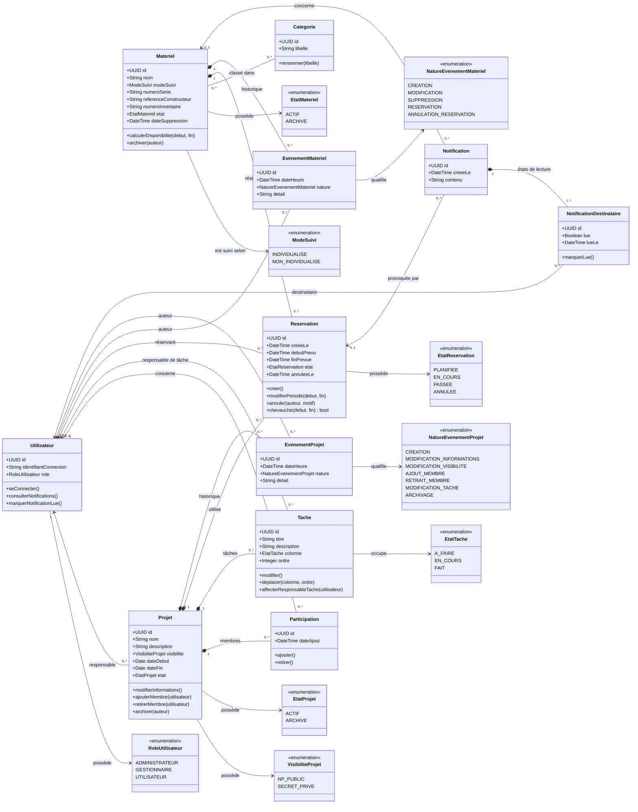

# SUIVI — Diagramme de classes d'analyse métier (DCLAM)

Le DCLAM ci-dessous décrit le modèle métier conceptuel de SUIVI. Il ne constitue pas encore un schéma de base de données ni un découpage des classes techniques.

## Contraintes métier portées par le modèle

- Un seul utilisateur possède le rôle `ADMINISTRATEUR` et son identifiant de connexion est `admin`.
- Il existe au maximum un utilisateur de rôle `GESTIONNAIRE` ; un gestionnaire ne participe à aucun projet.
- Chaque projet possède exactement un responsable. Ce responsable est obligatoirement relié au projet par une participation de membre.
- Une seule participation active est proposée par couple utilisateur–projet.
- Une tâche appartient à un seul projet ; son responsable de tâche facultatif doit être membre de ce projet.
- Une réservation concerne exactement un matériel individualisé, un projet et son réservant. Son début et sa fin sont obligatoires et alignés sur des minutes `00` ou `30`.
- Deux réservations en vigueur de projets différents ne peuvent pas se chevaucher pour le même matériel.
- Archiver un matériel conserve son historique et ses réservations, mais annule les réservations en cours et futures.
- Archiver un projet conserve ses membres, tâches, réservations et événements, libère ses réservations et interdit toute réouverture.
- L'état lu/non lu d'une notification appartient à chaque destinataire, jamais à la notification globalement.

Les attributs `ordre` d'une tâche, le détail des annulations et les états calculés d'une réservation restent des propositions de conception soumises aux arbitrages Q-22 et Q-26.
