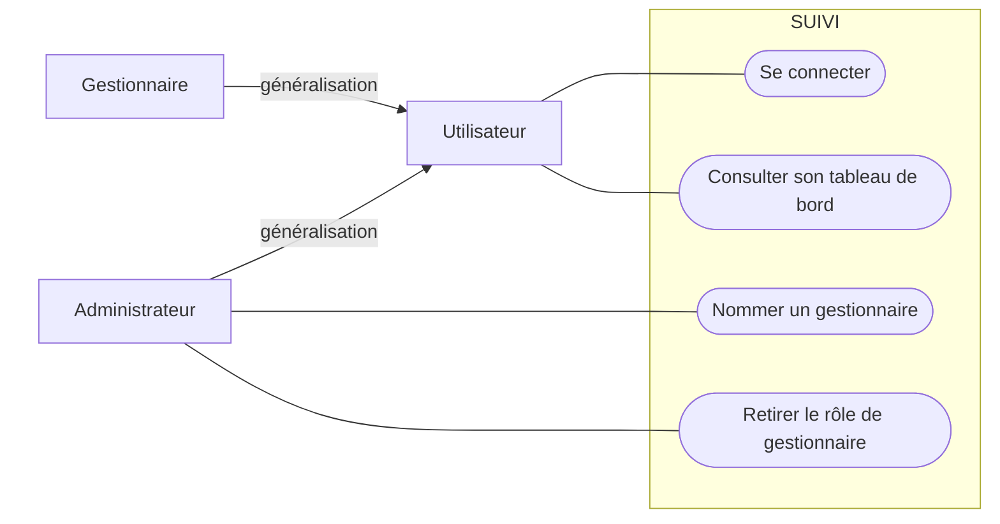
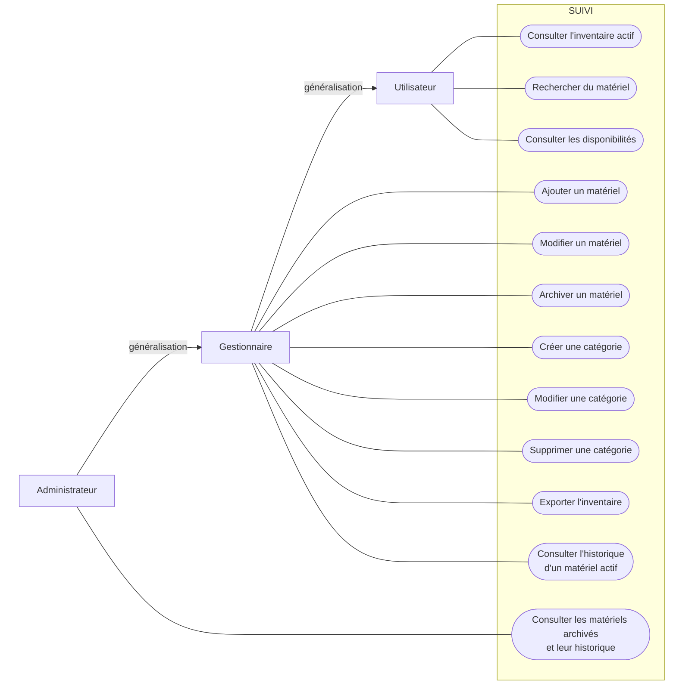
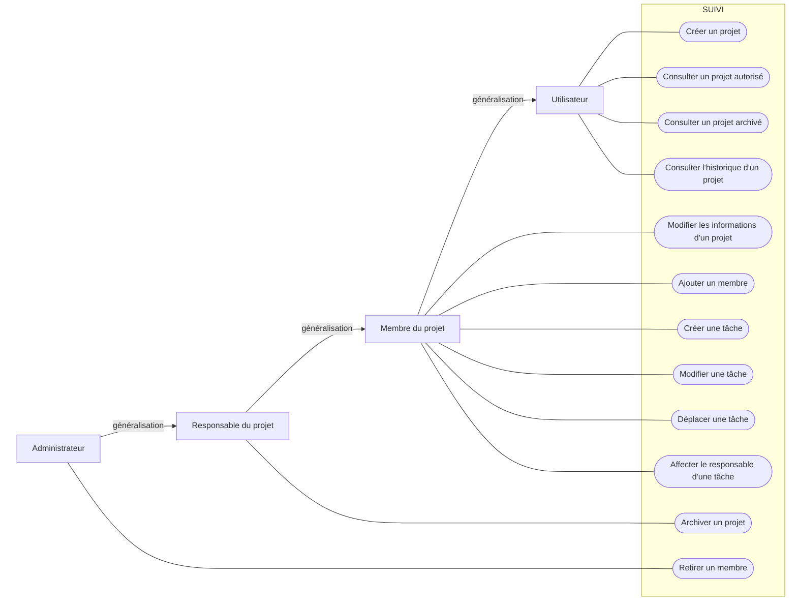
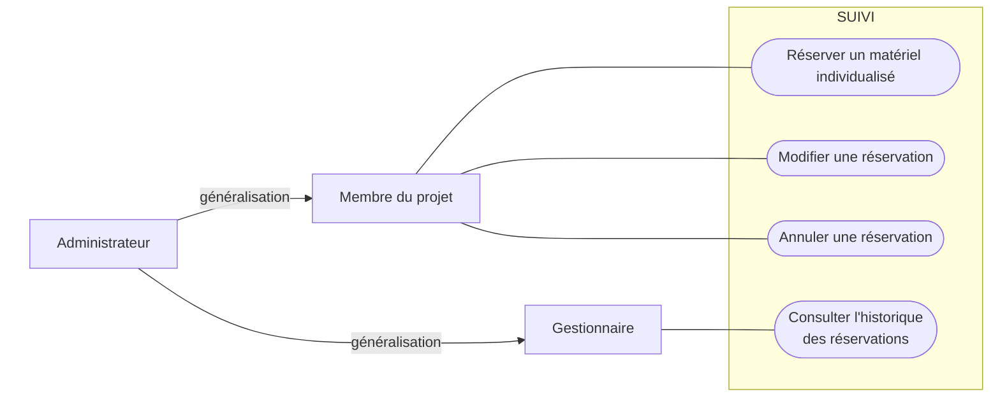
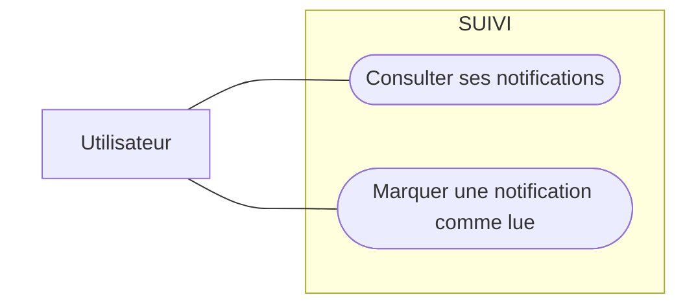

# SUIVI — Diagrammes de cas d'utilisation (DCU)

Les diagrammes sont construits selon la [spécification de construction des DCU](annexes/specification-dcu.md). Ils représentent les objectifs métier des acteurs, sans détailler les traitements internes, l'interface ni l'ordre d'exécution.

Dans chaque diagramme Mermaid, les acteurs sont disposés verticalement à gauche et les cas d'utilisation verticalement à droite, dans la frontière de **SUIVI**. Une flèche portant le libellé « généralisation » part de l'acteur spécialisé et remonte vers son acteur parent. Les autres liens sont des associations simples, sans flèche.

## DCU 1 — Accès et rôles

**Utilisateur** porte les interactions communes. **Administrateur** et **Gestionnaire** sont ses spécialisations et héritent donc de ses associations. La création automatique du compte au premier accès est un comportement interne conditionnel de la connexion, pas un objectif autonome.

## DCU 2 — Inventaire

Le gestionnaire hérite des consultations communes de l'utilisateur. L'administrateur hérite à son tour du gestionnaire : il récupère donc toutes ses associations et conserve uniquement le lien direct supplémentaire vers les matériels archivés. L'archivage est irréversible ; l'annulation des réservations et la production des notifications sont des conséquences métier internes.

## DCU 3 — Projets et Kanban

Le gestionnaire ne figure pas dans ce diagramme, car il n'accède à aucun projet. Le membre hérite de l'utilisateur, le responsable du projet hérite du membre et l'administrateur hérite du responsable. Le responsable est donc toujours membre de son projet. Chaque niveau récupère les associations du niveau précédent. L'administrateur conserve uniquement son lien direct supplémentaire vers le retrait d'un membre.

## DCU 4 — Réservations

L'utilisateur générique n'est pas représenté puisqu'il ne porte aucun cas d'utilisation dans ce périmètre. L'administrateur hérite du membre du projet et du gestionnaire : il récupère les actions de réservation du premier et la consultation de l'historique du second, sans association dupliquée. Le contrôle des minutes `00` ou `30`, de la disponibilité et des chevauchements constitue une règle obligatoire du service de réservation, pas un cas d'utilisation autonome. Seul le matériel individualisé est réservable.

## DCU 5 — Notifications

L'utilisateur consulte directement ses notifications et peut les marquer comme lues. Aucun rôle supplémentaire n'est nécessaire. La création d'une notification après l'archivage d'un matériel réservé est un comportement interne ; elle ne devient donc ni un acteur ni un cas d'utilisation.

## Relations UML spécialisées

- **Généralisation :** uniquement lorsqu'un acteur spécialisé hérite réellement des associations de son parent. La flèche part de la spécialisation et pointe vers le parent placé au-dessus.
- **`<<include>>` :** aucune. Aucun comportement métier commun et obligatoire ne justifie d'être isolé dans les diagrammes actuels.
- **`<<extend>>` :** aucune. Les comportements conditionnels identifiés relèvent de règles ou de conséquences internes, et non d'objectifs autonomes d'un acteur.

## Points non représentés comme acquis

Les points encore à arbitrer ne sont pas accordés : retrait d'un membre par un utilisateur, retrait ou remplacement du responsable, choix ou changement de visibilité, archivage par les membres autres que le responsable et suppression d'un projet.

## Validation

- Les acteurs sont externes à la frontière de SUIVI et alignés verticalement à gauche.
- L'acteur parent est placé au-dessus de ses spécialisations directes, sans acteur intermédiaire artificiel.
- Les flèches de généralisation remontent vers le nord et pointent vers le parent.
- Les cas d'utilisation sont alignés verticalement à droite, dans la frontière de SUIVI, et commencent par un verbe.
- Les associations acteur–cas sont des lignes simples, sans flèche.
- Un lien partagé n'est factorisé par héritage que si la spécialisation fonctionnelle est réelle.
- Les cas décrivent des objectifs métier, sans écran, composant technique, flux de données ou chronologie.
