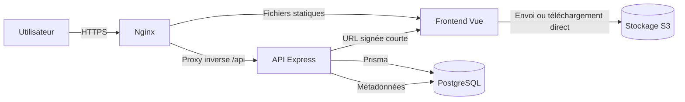

# Stack technique initiale et décisions d’architecture

**Statut :** architecture initiale proposée, à valider avant développement.  
**Mise à jour :** 23 septembre 2026.

Ce document définit le socle technique initial de SUIVI.

## Synthèse de la stack proposée

| Couche | Choix cible | Rôle |
| --- | --- | --- |
| Frontend | Vue 3, Vite, Vue Router, JavaScript | Application web monopage et navigation |
| État frontend | Pinia, seulement pour l’état partagé | Session, profil, préférences et notifications globales |
| API | Node.js 24 LTS, Express 5, JavaScript avec modules ES | API HTTP, règles métier et autorisations |
| Validation | Zod | Validation des entrées et contrat d’erreur homogène |
| ORM | Prisma ORM 7 | Modèle de données, requêtes typées en JavaScript et migrations |
| Base | PostgreSQL 17 | Données métier relationnelles et transactions |
| Fichiers | API compatible Amazon S3 ; MinIO en local | Pièces jointes, factures, bons de commande et exports |
| Authentification | JWT court dans cookie `HttpOnly`, avec renouvellement | Session applicative en attendant l’intégration Intradef |
| Conteneurs | Docker Compose pour le développement et la recette locale | Environnement reproductible |
| Tests | Vitest, Vue Test Utils et Supertest | Tests unitaires, composants et API |

Les versions majeures sont verrouillées dans les fichiers de dépendances lors de l’implémentation. Une mise à jour de version majeure doit faire l’objet d’une décision et d’une recette ciblée. Node.js 24 est retenu car il est en LTS ; Prisma recommande une version Node LTS supportée. Prisma 7 est préféré à une version candidate afin de conserver une base stable.

## Architecture cible



Le navigateur ne connaît qu’une origine publique servie par Nginx. Les appels relatifs `/api` sont relayés vers Express sur le réseau Docker ; Compose injecte `http://backend:4000` dans `API_UPSTREAM` au démarrage de Nginx. Cette adresse interne reste cohérente avec le port du service backend et n’est jamais intégrée au bundle JavaScript. En développement hors Docker, `DEV_API_UPSTREAM` configure le proxy Vite. Ni l’API ni PostgreSQL ne publient de port sur l’hôte. L’API est l’unique point d’application des droits et des règles métier. Les métadonnées d’un fichier sont stockées en base ; son contenu binaire est stocké dans S3.

## Justification des choix

### Vue 3 et Vite

Vue 3 est adapté à une application métier composée de formulaires, tableaux, modales et vues Kanban. Les composants monofichiers rendent la structure lisible et la Composition API facilite le partage de logique. Vite apporte un démarrage rapide en développement et une construction optimisée. `create-vue`, l’outil officiel, propose directement Vue Router et Pinia.

Le projet reste en JavaScript conformément au besoin exprimé. JSDoc et le contrôle strict de l’éditeur sont recommandés pour documenter les objets manipulés. TypeScript reste une amélioration possible si l’équipe accepte son coût d’apprentissage.

### Express 5 sur Node.js

Express convient à une API de taille modérée et conserve un socle JavaScript simple. Il est moins structurant qu’un framework complet, donc l’organisation suivante est imposée : routes, contrôleurs, services métier, accès aux données et middlewares. Une route ne doit pas contenir de requête Prisma ni de règle métier complexe.

Node.js 24 LTS est la cible de production. Une version LTS reçoit des correctifs sur une durée prévisible, contrairement aux versions courantes ou arrivées en fin de vie.

### PostgreSQL 17

Le domaine est fortement relationnel : utilisateurs, rôles, projets, participants, tâches, matériels, catégories et réservations. PostgreSQL fournit les clés étrangères, contraintes, transactions et index nécessaires. La version 17 est stable, prise en charge par Prisma et suffisamment mature pour constituer le socle initial.

Les règles critiques doivent être protégées au niveau de la base lorsque c’est possible : unicité, références, dates cohérentes et prévention des réservations incompatibles. Prisma ne remplace pas ces contraintes.

### Prisma ORM

Prisma centralise le modèle, rend les requêtes plus lisibles et fournit des migrations versionnées. Il réduit les chaînes SQL dispersées dans les contrôleurs et facilite les transactions. Il ne faut toutefois pas masquer les capacités de PostgreSQL : les contraintes avancées, index partiels ou requêtes complexes peuvent nécessiter une migration SQL ou une requête SQL contrôlée.

Règles d’utilisation proposées :

- une migration est créée, relue et versionnée pour chaque évolution de schéma ;
- `prisma migrate deploy` est utilisé en recette et production, jamais `db push` ;
- le client Prisma est instancié une seule fois par processus ;
- les séquences multi-écritures utilisent une transaction ;
- aucun secret ni URL de base n’est inscrit dans le dépôt.

### Stockage S3

PostgreSQL conserve uniquement les métadonnées : identifiant, propriétaire, rattachement métier, clé objet, nom original, type MIME, taille, empreinte, état et dates. Le fichier est stocké dans un bucket privé.

Le flux recommandé est le suivant :

1. le frontend demande une autorisation d’envoi à l’API ;
2. l’API vérifie le rôle, le rattachement et les limites, puis génère une clé imprévisible ;
3. l’API renvoie une URL signée de courte durée ;
4. le navigateur envoie directement le fichier vers S3 ;
5. le frontend confirme la fin de l’envoi et l’API valide les métadonnées.

Les URL signées donnent un accès temporaire sans transmettre les identifiants S3 au navigateur. Les clés doivent être uniques : envoyer un objet sur une clé existante peut remplacer l’objet. MinIO est proposé uniquement pour le développement local, car il expose une API compatible S3. En production, le service peut être Amazon S3 ou un stockage objet compatible validé par l’hébergeur Intradef.

Contrôles minimaux : bucket privé, chiffrement au repos, TLS, liste blanche de types, taille maximale, nom de fichier neutralisé, contrôle d’autorisation à chaque téléchargement, journalisation et analyse antivirus asynchrone avant mise à disposition.

## Topologie Docker Compose cible

Le fichier Compose cible contiendra les services suivants :

| Service | Exposition locale | Persistance | Remarque |
| --- | --- | --- | --- |
| `frontend` | `APP_PORT` vers `80` | aucune | Build Vue de production servi par Nginx et proxy inverse `/api` |
| `backend` | réseau Docker uniquement | aucune | API Express de production, non exposée sur l’hôte |
| `migrate` | aucune | aucune | Tâche éphémère de migration et d’initialisation avant l’API |
| `postgres` | réseau Docker uniquement | volume nommé | Base non exposée sur l’hôte |
| `minio` | `9000` et console `9001` | volume nommé | Émulation S3 locale uniquement |
| `minio-init` | aucune | aucune | Création idempotente du bucket puis arrêt |

Les services `frontend`, `backend` et `postgres` disposent d’un contrôle de santé. Le backend attend la réussite de la tâche de migration, qui attend elle-même PostgreSQL. Les données sont conservées dans des volumes nommés. Les secrets réels sont injectés par l’environnement ; le fichier `.env.example` ne contient que des valeurs de démonstration.

Le Compose fournit un environnement intégré local proche de la production et sert à la recette. Pour le développement avec rechargement à chaud, Vite relaie également `/api` vers Express sans exposer l’adresse du backend au code navigateur. En production cible, PostgreSQL et S3 sont de préférence des services administrés et les migrations restent exécutées par une tâche dédiée avant la nouvelle version.

## Organisation cible du dépôt

```text
/
├── frontend/              application Vue
├── backend/
│   ├── prisma/            schéma et migrations
│   ├── src/
│   │   ├── routes/
│   │   ├── controllers/
│   │   ├── services/
│   │   ├── repositories/
│   │   └── middlewares/
│   └── tests/
├── database/              SQL exceptionnel et documentation DB
├── docs/                  documentation fonctionnelle et technique
├── maquettes/             prototype statique
└── docker-compose.yml
```

`database/` ne doit pas devenir un second système de migrations. Les migrations applicatives résident dans `backend/prisma/migrations`; `database/` est réservé aux scripts d’exploitation exceptionnels clairement documentés. Il peut être omis si aucun tel script n’est nécessaire.

## Sécurité et exploitation

- Valider toutes les entrées côté API, indépendamment des validations Vue.
- Centraliser authentification et autorisation dans des middlewares, puis refaire les contrôles métier dans les services sensibles.
- Préférer un cookie `HttpOnly`, `Secure` et `SameSite` au stockage du JWT dans `localStorage`.
- Limiter le débit de la connexion et des opérations coûteuses.
- Ajouter les en-têtes de sécurité, une politique CORS restrictive et une limite de taille JSON.
- Produire des journaux structurés avec un identifiant de corrélation, sans mot de passe, jeton ni contenu de fichier.
- Sauvegarder PostgreSQL et versionner les objets S3 ; tester régulièrement la restauration.
- Exposer des sondes distinctes de vie et de disponibilité.
- Scanner les dépendances et les images dans l’intégration continue.

## Tests et qualité

Le socle attendu comprend :

- tests unitaires des règles métier ;
- tests de composants Vue sur les parcours critiques ;
- tests d’intégration API avec une base PostgreSQL isolée ;
- tests des migrations sur une base vide et sur une copie anonymisée ;
- scénario de bout en bout pour connexion, projet, inventaire, réservation et pièce jointe ;
- formatage et lint obligatoires avant fusion.

L’intégration continue doit installer les dépendances de façon déterministe, lancer les contrôles, construire les images et vérifier les migrations. Une image n’est promue qu’une fois ; la même image passe de la recette à la production.

## Alternatives et améliorations possibles

| Sujet | Choix initial | Alternative | Quand la retenir |
| --- | --- | --- | --- |
| Framework API | Express 5 | Fastify | Si le débit, la validation par schéma ou les plugins deviennent prioritaires |
| Structure backend | JavaScript modulaire | NestJS avec TypeScript | Si l’équipe grandit et souhaite un cadre très prescriptif |
| État serveur frontend | appels dédiés | TanStack Query pour Vue | Si cache, invalidation et synchronisation deviennent complexes |
| Tâches asynchrones | traitement dans l’API | file de messages + worker | Pour antivirus, exports lourds, notifications ou miniatures |
| Sessions | JWT court + renouvellement | session serveur | Si la révocation immédiate et la simplicité priment sur le sans-état |
| Base de production | PostgreSQL autohébergé | PostgreSQL administré | Recommandé dès que sauvegardes, haute disponibilité et astreinte comptent |
| Stockage local | MinIO | LocalStack | Si d’autres services AWS doivent aussi être simulés |

Redis, une file de messages, Kubernetes et une architecture en microservices ne sont pas nécessaires au démarrage. Ils ajoutent de l’exploitation sans répondre à un besoin actuellement établi.

## Ordre de mise en place proposé

1. Valider cette décision, les contraintes Intradef et le fournisseur S3 de production.
2. Initialiser le monorepo, les images Docker et le Compose local.
3. Définir le modèle Prisma, générer la migration initiale et les données minimales de développement.
4. Mettre en place le squelette Express : configuration, erreurs, validation, authentification et autorisations.
5. Créer le socle Vue : navigation, mise en page, session et client API.
6. Développer les domaines fonctionnels verticalement, avec API, interface et tests pour chaque parcours.
7. Ajouter le stockage objet et les pièces jointes après validation des limites, types et règles de conservation.
8. Finaliser les contrôles de sécurité, sauvegardes, supervision et procédure de déploiement avant la mise en production.

## Points à arbitrer avant implémentation

- fournisseur S3 ou compatible S3 autorisé sur Intradef ;
- taille, types, durée de conservation et analyse antivirus des pièces jointes ;
- mode d’authentification cible et disponibilité d’un annuaire/OIDC ;
- besoin d’accès hors ligne et niveau réel de PWA ;
- stratégie de sauvegarde, objectifs de reprise et durée de conservation ;
- navigateurs supportés et contraintes réseau de l’environnement cible ;
- choix entre JavaScript documenté et TypeScript pour le frontend.

## Références techniques

- [Guide de démarrage Vue](https://vuejs.org/guide/quick-start)
- [Versions et statut LTS de Node.js](https://nodejs.org/en/about/previous-releases)
- [Prérequis système Prisma ORM](https://docs.prisma.io/docs/orm/reference/system-requirements)
- [Bases PostgreSQL prises en charge par Prisma](https://docs.prisma.io/docs/orm/reference/supported-databases)
- [Envoi S3 par URL présignée](https://docs.aws.amazon.com/AmazonS3/latest/userguide/PresignedUrlUploadObject.html)
